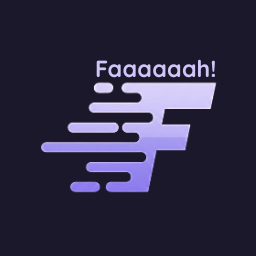

  

# Faaaaaah!

Faaaaaah! is a lightweight local judge for competitive programming in VS Code. It streamlines the testing process by allowing you to run code against multiple test cases directly from the editor.

---

## Features

- **Integrated Panel**: Accessible via the Activity Bar or keyboard.
- **Keyboard Shortcut**: `Ctrl+Alt+J` or `Cmd+Alt+J` for rapid access.
- **Multi-Language Support**: Supports C, C++, and Python.
- **Persistence**: Test cases are saved per workspace file.
- **Audio-Visual Alerts**: Instant feedback via sound and screen flash on failure.
- **Simple Management**: Add, delete, and re-order cases easily.

## Requirements

The following must be available in your system `PATH`:

- **C/C++**: `gcc` / `g++`
- **Python**: `python` or `python3`

## Quick Start

1. **Open File**: Open any `.c`, `.cpp`, or `.py` file.
2. **Open Panel**: Use the Activity Bar icon or `Ctrl+Alt+J`.
3. **Add Cases**: Input your data and expected output.
4. **Run**: Execute individual cases or all at once.

## Technical Notes

Built using the VS Code Webview API and TypeScript. Execution is performed via child processes, ensuring fast and isolated runs.

## Contributing

1. Fork the repository
2. Create your feature branch (`git checkout -b feature/NewFeature`)
3. Commit and push your changes
4. Open a Pull Request

---

  Built for the competitive programming community.

